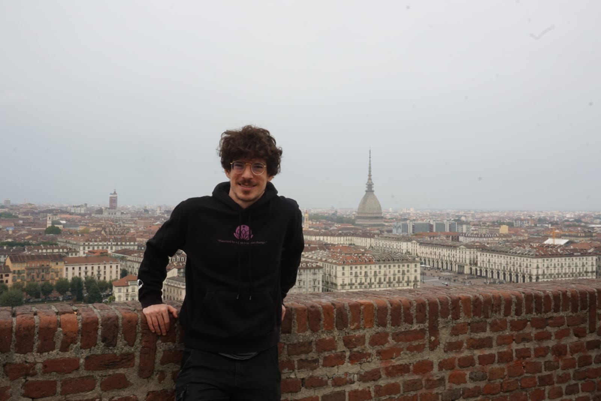

@@page-layout
@@sidebar
@@profile-pic

@@

~~~

  

    📧
    <a href="mailto:simonepell2003@gmail.com" style="text-decoration: none; color: #333;">simonepell2003@gmail.com</a>
  

  

    📞
    331 746 5423
  

  

    
    <a href="https://www.linkedin.com/in/simone-pellegrini-6556792b5" style="text-decoration: none; color: #333;">Linkedin</a>
  

  

    
    <a href="https://github.com/SimonePellegrini" style="text-decoration: none; color: #333;">GitHub</a>
  

~~~

@@
@@main-content
# Hey, I'm Simone. Nice to meet you 🧙‍♂️
@@work
Welcome, traveler! 👋 I'm Simone, an MSc Computer Science student passionate about learning, teaching, and exploring the world.
\\\\
This is my digital corner where I share updates on my projects and academic journey. I'm always open to new challenges and meeting interesting people. Whether you'd like to collaborate or just say hi, feel free to reach out!
@@
@@
@@
## Work Experience 💼
**Research Intern | *Algorithms@TorVergata* (March 2025 - March 2026)**
\\
@@work-in-cws
Worked alongside Prof. Luciano Guala's research group on extracting dense subgraphs from dynamic networks. Presented a preliminary version of our work at the CACN workshop.
@@

**Computer Science Student Representative | *Tor Vergata* (Jan 2024 - Jul 2025)**
\\
@@work-in-cws
Served as a student representative for my faculty. Collaborated with students and professors to improve the Computer Science experience at Tor Vergata :).
@@

**Academic Tutor | (Sept 2023 - Present)**
\\
@@work-in-cws
Tutored high school and first-year university students, creating custom lessons tailored to their specific needs. So far, I have taught basic math, Discrete Math, Logic, and introductory programming (C/Python).
@@

## Education 📚

**MSc in Computer Science | *Tor Vergata* (Present)**

**BSc in Computer Science | *Tor Vergata* (July 2025)**
\\
@@work-in-cws
Final Grade: 110/110 cum laude \\
Grade Point Average (GPA): 29.15 / 30
@@

**High School Diploma in Scientific Studies | *Liceo Scientifico Volterra* (July 2022)**
\\
@@work-in-cws
Final Grade: 100/100
\\
Participated in a project organized by INAF (National Institute for Astrophysics) focused on identifying the age of celestial objects from satellite data using Python.
@@

## Passions and Interests 🎶
In my free time, I enjoy reading books, listening to music (my favorite band is The Beatles), and playing the guitar.\\\\
I'm a huge fan of Rubik's cubes, similar logic puzzles, and the tech behind chess engines :)